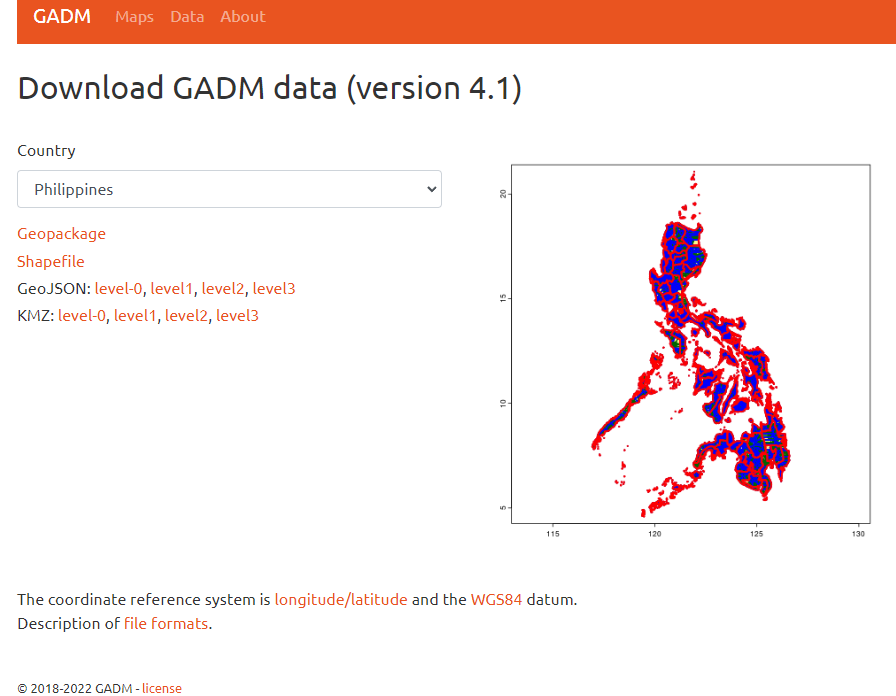
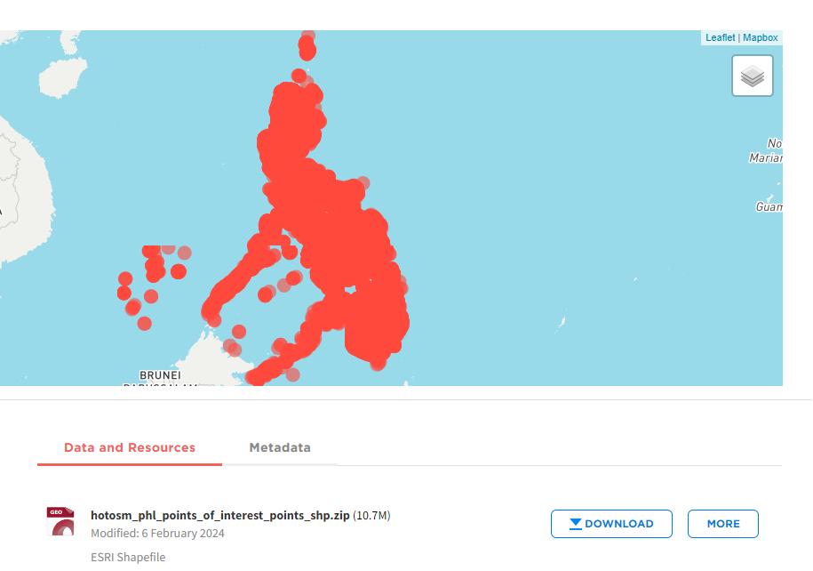

# PH_GSA_with_gadm_and_osm
PH Geospatial Analysis with GADM and OSM shapefiles
***
## Download shape files from:
GADM - https://gadm.org/download_country.html

- pick country
- download shapefile

PH points of interest - https://data.humdata.org/dataset/hotosm_phl_points_of_interest

## Setup sqlite3
- install requirements.txt 
- Unzip shapefile and put it in your directory
- Open `init_gsa.ipynb` abd run

## Main Content
Main content at `gsa.ipynb`